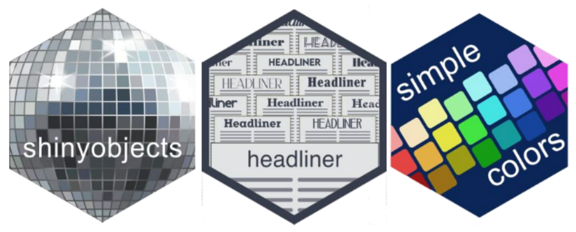
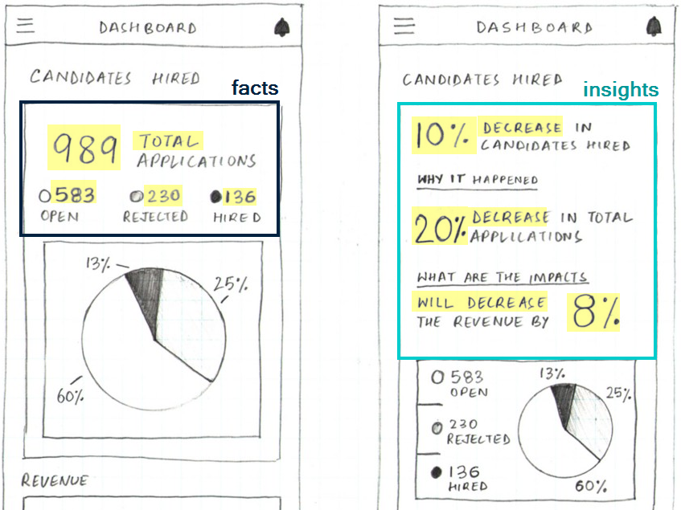
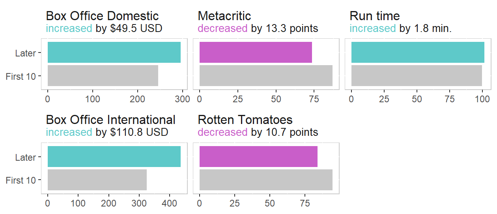

```{css css-extra, echo=FALSE}
.title-slide {
  vertical-align: bottom !important;
  text-align: left !important;
  background-image: url(figures/logo-dark.png);
  background-size: 440px;
}

.header-link {
  color: #E6E6E6;
}

.remark-inline-code {
  background-color: #E6E6E6;
}

.large { font-size: 130% }
.small { font-size: 70% }
```


```{r css-theme, include=FALSE, eval=FALSE}
# don't need to run each time, just on changes
library(xaringanthemer)
library(simplecolors)

xaringanthemer::style_mono_light(
  
  table_row_even_background_color = "transparent",
  
  code_font_size = "1.3em",
  code_highlight_color = sc("grey3"),
  
  code_inline_color = "black",
  code_inline_font_size = "1.3em",
  code_inline_background_color = sc("grey3"),
  
  header_background_padding = "0px",
  header_background_content_padding_top = "0px",
  link_decoration = "underline",
  text_font_family = xaringanthemer_font_default("text_font_family")
)
```


```{r workspace, include=FALSE}
options(htmltools.dir.version = FALSE)
knitr::opts_chunk$set(
  fig.width = 9, fig.height = 3.5, fig.retina = 3,
  message = FALSE,
  warning = FALSE,
  hiline = TRUE,
  eval = FALSE
)

library(tidyverse)
library(headliner)
library(simplecolors)
library(flair)
library(glue)
library(gt)


registerS3method(
  genname = "knit_print",
  class = "with_flair",
  method = knit_print.with_flair,
  envir = asNamespace("knitr")
)


highlight_colors <- simplecolors::sc_across(light = 1, return = "table")

hl <- 
  set_names(
    x = highlight_colors$hex,
    nm = str_remove(highlight_colors$color_name, "muted|\\d")
  ) |> 
  as.list() |> 
  append(c(grey3 = sc("grey3")))

```


## About Me

.pull-left[
.large[

* Clinical Data Analyst

<br>
* Data viz/maps
    - Tableau, Qlik, R

<br>
* R Package Development
    - `simplecolors`
    - `shinyobjects`
    - **`headliner`**
    
]
]

.pull-right[


<br><br><br>


]

---

## Building an insightful dashboard is not easy

.pull-left[
 ### Facts
 
 * Easy out of the box
 * Risk of low adoption


 ### Insights
 
 * More meaningful
 * Risk of high technical debt
]

.pull-right[


]

---

## What's a good title for this chart?

.pull-left[
#### "Callback response times by month"
* Vague, no insight, no lift

#### "Callback response times by month"
* Vague, no insight, no lift

#### "Callback response times by month"
* Vague, no insight, no lift

]

.pull-right[
```{r, echo=FALSE, eval=TRUE}
compare_values(24, 32) |> 
  view_list() |> 
  rownames_to_column() |>
  select(value = value, name = rowname) |> 
  mutate(name = paste0("{", name, "}")) |> 
  gt::gt() |> 
  gt::tab_options(column_labels.hidden = TRUE) |> 
  gt::tab_style(
    style = "padding-right:15px;padding-left:15px;padding-bottom:5px;padding-top:5px;font-size:12pt;",
    locations = cells_body()
  ) |> 
  gt::tab_style(
    style = cell_text(font = google_font(name = "Space Mono")),
    locations = cells_body(name)
  ) |> 
  gt::tab_header(
    title = md("**Talking Points**"),
    subtitle = md("`compare_values(24, 32) |> view_list()`")
  ) |> 
  gt::fmt_markdown(columns = everything()) |> 
  gt::cols_align("right", value) #|> cols_width(everything() ~ px(150))

```{r}
pixar_films |> 
  ggplot(aes(release_date, run_time)) +
  geom_line()
```
]


---


##

```{r headline-basic, echo=FALSE}
headline(
  x = 8:12,
  y = 12:8,
  headline = "there was {article_delta_p}% {trend}"
)
```

```{r, echo=FALSE, eval=TRUE}
decorate("headline-basic") |> 
  flair_rx("\\{[^\\}]*\\}") |> 
  flair_rx("#.*", color = hl$grey3)
```

---

##

```{r, echo=FALSE}
headline_anatomy <- as_glue(
'headline(
  x = 8:12,
  y = 12:8,
  headline = "there was {article_delta_p}% {trend}"
)'
)
```

```{r}
print(headline_anatomy)
```

```{r}
decorate(headline_anatomy) |> 
  flair_rx("x = .*")
```

```{r}
decorate(headline_anatomy) |> 
  flair_rx("y = .*")
```

```{r}
decorate(headline_anatomy) |> 
  flair_rx("headline = .*")
```

---


## Using `headliner` + `ggtext`

### How do recent Pixar films compare to the fist 10 movies?
.center[
  
]


---

##

```{r}

```

---

##

```{r}

```

---

##

```{r}

```

---

##

```{r}

```

---

##

```{r}

```

---

##

```{r}

```

---

##

```{r}

```

---

##

```{r}

```

---

##

```{r}

```

---
