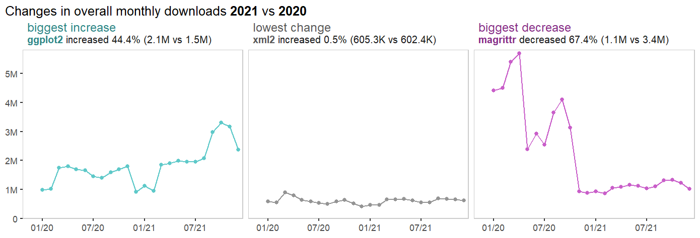
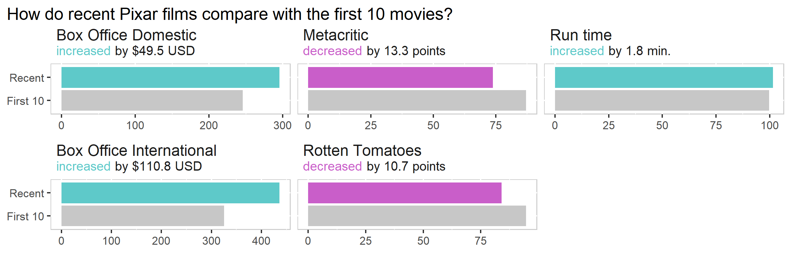

class: bottom

```{css css-extra, echo=FALSE}
.title-slide {
  background-image: url(figures/logo-dark.png);
  background-size: 440px;
}

.header-link {
  color: #E6E6E6;
}

.remark-inline-code {
  background-color: #E6E6E6;
}

.large { font-size: 130% }
.small { font-size: 70% }

.small .remark-code { font-size: 90%}
```


.pull-left[
.large[
## `headliner`

### Jake Riley - 6/14/22

[slides](https://github.com/pages/rjake/talks-and-presentations/.../README.html) 
| [code](https://github.com/rjake/talks-and-presentations/.../README.md)

]
]

.pull-right[

]

---


```{r css-theme, include=FALSE, eval=FALSE}
# don't need to run each time, just on changes
library(xaringanthemer)
library(simplecolors)

# setwd to here
setwd(dirname(.rs.api.getSourceEditorContext()$path))

xaringanthemer::style_mono_light(
  table_row_even_background_color = "transparent",
  base_font_size = px(12),
  #code_font_size = "1.3em",
  code_highlight_color = sc("grey2"),
  
  code_inline_color = "black",
  #code_inline_font_size = "1.3em",
  code_inline_background_color = sc("grey2"),
  
  header_background_padding = "0px",
  header_background_content_padding_top = "0px",
  link_decoration = "underline",
  text_font_family = xaringanthemer_font_default("text_font_family")
)
```


```{r workspace, include=FALSE}
options(htmltools.dir.version = FALSE)
knitr::opts_chunk$set(
  fig.width = 9, fig.height = 3.5, fig.retina = 3,
  R.options = list(width = 120),
  comment = "",
  message = FALSE,
  warning = FALSE,
  hiline = TRUE
)

library(tidyverse)
library(headliner)
library(simplecolors)
library(flair)
library(glue)
library(gt)
library(flipbookr)
library(fontawesome)


registerS3method(
  genname = "knit_print",
  class = "with_flair",
  method = knit_print.with_flair,
  envir = asNamespace("knitr")
)


highlight_colors <- simplecolors::sc_across(light = 1, return = "table")

hl <- 
  set_names(
    x = highlight_colors$hex,
    nm = str_remove(highlight_colors$color_name, "muted|\\d")
  ) |> 
  as.list() |> 
  append(c(grey3 = sc("grey3")))


gt_custom <- function(df) {
  gt(df) |>
    tab_style(
      style = 
        "padding-right:15px; padding-bottom:5px;
         padding-left: 15px; padding-top:   5px;",
      locations = cells_body()
    )
}
```

## About Me

.pull-left[
.large[
* Jake Riley
<br>

* Data Analyst @ CHOP
   <br><br>
   

<br>
* Data viz & geo-spatial analyses
    - Tableau, Qlik, R
    <br><br>
    

]
]

.pull-right[

* R Package Development
    - `simplecolors`
    - `shinyobjects`
    - **`headliner`**
    <br><br>
    
]

---


## Building an insightful dashboard is not easy

.pull-left[

These dashboards have the same underlying data but really different user experience

 ### Facts
 
 * Easy out of the box

 * Risk of low adoption


 ### Insights
 
 * More meaningful

 * Risk of high technical debt

]

.pull-right[

]

---

## What's a good title for this chart?

.pull-left[
* **`ggplot2` downloads by month**

  * static
  
  * vague, no insight
  
  * low lift

<br> 
* **`ggplot2` monthly downloads changed from 1.5M to 2.1M**

  * somewhat dynamic
  
  * low insight
  
  * some lift

<br> 
* **`ggplot2` monthly downloads increased 44% (2.1M vs 1.5M)**

  * very dynamic
  
  * good insight
  
  * heavy lift
]

.pull-right[

]


---

## Enter `headliner`

.pull-left[

`headliner` is an R packaged focused on informative titles <br>

.center[]


Given two values, `headliner` gives metadata about the difference

```{r eval=TRUE, echo=FALSE}
as_glue(
"
headline(x = 32, y = 24)
> increase of 8 (32 vs. 24)


headline(x = 24, y = 32)
> decrease of 8 (24 vs. 32)
"
) |> 
  decorate(eval = FALSE) |> 
  flair_rx("> .*", color = sc("grey3")) |> 
  flair_rx("..crease")
```

As a default, `headline()` uses `glue` and the following default
```{r eval=FALSE}
headline(
  x = 24, 
  y = 32,
  headline = "{trend} of {delta} ({orig_values})"
)
```

]

.pull-right[
```{r talking-points, echo=FALSE, eval=TRUE}
compare_values(24, 32) |> 
  view_list() |> 
  rownames_to_column() |>
  select(value = value, name = rowname) |> 
  mutate(name = paste0("{", name, "}")) |> 
  gt_custom() |> 
  tab_options(column_labels.hidden = TRUE) |> 
  tab_style(
    style = cell_text(font = google_font(name = "Space Mono")),
    locations = cells_body(name)
  ) |> 
  tab_header(
    title = md("**Talking Points**"),
    subtitle = md("`compare_values(24, 32) |> view_list()`")
  ) |> 
  fmt_markdown(columns = everything()) |> 
  cols_align("right", value) #|> cols_width(everything() ~ px(150))

```
]


---

## Using `glue()` under the hood

.pull-left[
`glue()` embeds R expressions in curly braces and combines them to produce a longer string

```{r}
my_age <- 37

glue("I am {my_age}")
```

Temporary objects can be created as the function is called like `x` and `y`
```{r}
glue(
  x = 24,
  y = 32,
  "{(x - y) / y}, {x} vs. {y}"
)
```

`headliner` simplifies the steps
```{r}
headline(
  x = 24, 
  y = 32,
  "{delta_p}% {trend}, {orig_values}"
)
```

]

.pull-right[
```{r ref.label='talking-points', echo=FALSE}
```
]

---

## Examples

.pull-left[
```{r headline-basic, echo=FALSE, eval=FALSE}
headline(
  x = 8:12,
  y = 12:8,
  headline = 
    "There was {article_delta_p}% {trend} ({x} vs {y})"
)
```

```{r, echo=FALSE, eval=TRUE}
decorate("headline-basic") |> 
  flair_rx("\\{[^\\}]*\\}") |> 
  flair_rx("#.*", color = hl$grey3)
```

```{r}
headline(8, 10, "{trend}d by {delta_p}%")
headline(8, 10, "{trend}d by {delta} ({raw_delta_p}%)")
headline(8, 10, "Difference: {raw_delta} (today = {x}, prior = {y})")
```

]

.pull-right[

```{r ref.label='talking-points', echo=FALSE}
```
]

---

## Perks of `glue`
.pull-left[
Because `headline()` uses `glue`, you can pass it other variables/objects
```{r}
glue(
  a = 1,
  b = 2,
  "{a} and then {b}, total = {a + b}"
)
```

Here, I am capitalizing the first word and formatting a date
```{r}
headline(
  8, 10, 
  "{cap(trend)}d by {delta_p}% (as of {today})",
  cap = stringr::str_to_sentence,
  today = format(Sys.Date(), "%D")
)
```

You can also concatenate with `+`

```{r}
headline(9, 10) + "; " + headline(8, 5)
```

]

.pull-right[
```{r ref.label='talking-points', echo=FALSE}
```
]

---

## Specify phrasing for trends

.pull-left[
You can change the wording of "increase" / "decrease" with <br>
`trend_phrases = trend_terms()`
```{r}
headline(
  8, 10,
  trend_phrases = trend_terms(more = "higher",  less = "lower"),
  headline = "{trend} by {delta}"
)
```

<br>

You can also pass a named list
```{r}
headline(
  10, 8,
  trend_phrases = list(
    higher = trend_terms(more = "higher",  less = "lower"),
    more = trend_terms(more = "more", less = "less")
  ),
  headline = "{higher} by {delta_p}% ({delta} {more})"
)

```
]

.pull-right[
```{r ref.label='talking-points', echo=FALSE}
```
]

---

## Similar rules apply for plurality

.pull-left[
```{r}
headline(
  x = 21:22, 
  y = 20,
  plural_phrases = list(  
    people = plural_phrasing(single = "person", multi = "people"),
    these_employees = plural_phrasing("This new employee", "These new employees")
  ),
  headline = 
    "We hired {delta} new {people}. {these_employees} will start {next_monday}.",
  next_monday = 
    (lubridate::ceiling_date(Sys.Date(), "week") + 1) |> 
    format("%A, %B %e")
)

```
]

.pull-right[
```{r ref.label='talking-points', echo=FALSE}
```
]

---

## `compare_conditions()`

`add_date_columns()` will add day, week, quarter, etc to an existing data frame

```{r}
demo_data() |>
  add_date_columns(date_col = date)
```

`compare_conditions()` then aggregates the data - this relies heavily on `across()`

```{r}
yoy <- 
  demo_data() |>
  add_date_columns(date) |> 
  compare_conditions(
    x = (month == 0),   # this month
    y = (month == -12), # vs 12 months ago
    .cols = sales       # the column(s) to aggregate
  ) |> 
  print()
```

---

## Data frames

If a single row, can use `headline_list()` (may give a better name) - **this returns a headline**
```{r}
yoy

yoy |> headline_list()
```

If many rows, can use `add_headline_column()` - **this returns a data frame** + the specified talking points (`return_cols`)
```{r}
pixar_films |> 
  select(film, rotten_tomatoes, metacritic) |> 
  add_headline_column(
    x = rotten_tomatoes, 
    y = metacritic,
    headline = "{film} was {delta} points {trend}",
    trend_phrases = trend_terms("higher", "lower"),
    return_cols = c(delta, raw_delta)
  ) |> 
  arrange(desc(delta))
```

---

class: center, middle

# In practice

---

## Tidyverse downloads with `ggtext`

.center[
  
]
.pull-left[
```{r eval=FALSE}
df |> 
  add_headline_column(
    headline = "{package} {trend}d {delta_p}% ({ln(x)} vs {ln(y)})",
    return_cols = c(delta, raw_delta),
    # extra arguments passed on to glue
    ln =
      scales::label_number(
        accuracy = 0.1,
        scale_cut = cut_short_scale()
      )
  )
```
]

.pull-right[
```{r eval=FALSE}
df |>
  mutate(
    keep =
      case_when(
        delta == min(delta) ~ "lowest change",
        raw_delta == min(raw_delta) ~ "biggest decrease",
        raw_delta == max(raw_delta) ~ "biggest increase"
      )
  ) |>
  drop_na(keep)
```

]

---

## Another example using `pixar_films`

.center[
  
]

.pull-left[
```{r, eval=FALSE}
pixar_long |>
  group_by(metric) |>
  compare_conditions(
    x = film_order > 10,
    y = film_order <= 10,
    .cols = value
  )
```

]
.pull-right[
```{r, echo=FALSE}
tribble(
  ~metric,           ~title,                    ~template,
  "bo_domestic",     "Box Office Domestic",     "{trend}d by ${delta} USD",
  "bo_intl",         "Box Office International","{trend}d by ${delta} USD",
  "metacritic",      "Metacritic",              "{trend}d by {delta} points",
  "rotten_tomatoes", "Rotten Tomatoes",         "{trend}d by {delta} points",
  "run_time",        "Run time",                "{trend}d by {delta} min."
)
```
]
---

## How we've used it at CHOP

.center[
 
]

---

## How we've used it at CHOP

.center[
 
]

---

## Code for CHOP

.pull-left[
```{r eval=FALSE}
# return just the name of the look back month
month_lookback <- function(n) {
  floor_date(
    x = Sys.Date() - months(n),
    unit = "month"
  ) |>
    month(
      label = TRUE,
      abbr = FALSE
    )
}


make_adc_headlines <- function() {
  headline( # last month ADC vs 2 months ago ADC
    x = adc(1), 
    y = adc(2),
    headline = 
      "The average midnight daily census for {month_lookback(1)} was 
      {blue(x)}, a {delta}-point {trend} 
      since {month_lookback(2)}'s end-of-month ADC of {y}. "
  ) +
    headline( # last month ADC vs last month Budget
      x = adc(1), 
      y = budget(1),
      headline = 
        "This is {blue(delta)} ({round(delta_p)}%) {trend} 
        the budgeted {month_lookback(1)} ADC of {y}.",
      trend_phrases = trend_terms("above", "below")
    )
}

```
]

.pull-right[
The average midnight daily census for **May** was **---**, a **14**-point **increase** since **April**’s end-of-month ADC of **---**. This is **---** (**8**%) **above** the budgeted **May** ADC of **---**.
]

---

## Next steps
.pull-left[
.large[

### Already on CRAN 

* `install.packages("headliner")`

* one intro vignette

* documentation @ https://rjake.github.io/headliner

### In progress

* Fix NA-value error

* Increase language support beyond English

* Set default values globally

* headline widget (shiny)


### I'd love your feedback

* `r fa("envelope")` rjake@sas.upenn.edu

* `r fa("github")` github.com/rjake/headliner/issues


]
]

.pull-right[

]

